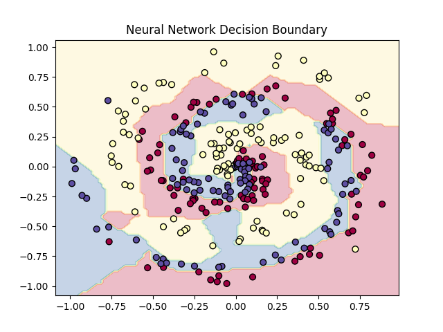
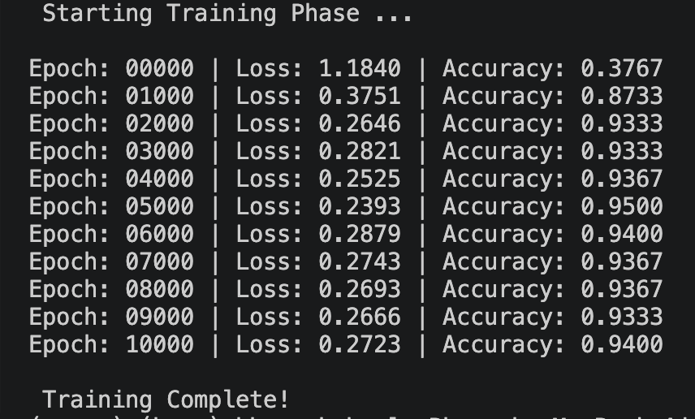

# 01. Neural Networks From Scratch 

## Objective
The goal of this module is to build a fully functional Deep Neural Network using pure **NumPy**. By avoiding auto-differentiation frameworks like PyTorch or TensorFlow, this code demonstrates a rigorous mathematical understanding of forward propagation, matrix calculus, and the backpropagation algorithm.

## Implemented Architecture & Mathematical Foundation

### 1. Layers
* **Dense (Linear):** $Y = XW + b$. Gradients computed analytically via chain rule.
* **ReLU Activation:** $f(x) = \max(0, x)$. Zeroes out negative gradients.
* **Softmax Activation:** Normalized probability distribution with max-shifting for numerical stability.

### 2. Loss Function (Categorical Cross-Entropy)
Calculates the penalty for incorrect probability assignments. 
* **Forward Pass:** $L = -\frac{1}{N} \sum y_{true} \log(y_{pred})$
* **Backward Pass:** $\frac{\partial L}{\partial Y_{pred}} = -\frac{y_{true}}{N \cdot y_{pred}}$ *(Clipped by $\epsilon$ to prevent division by zero).*

### 3. Sequential Engine
A PyTorch-style container that aggregates layers, handling the global `forward()` looping and the `reversed()` iteration required for proper `backward()` gradient chaining.

### 4. Optimizer (SGD with Momentum)
Updates the network parameters using an accumulated velocity matrix to power through local minima and dampen oscillations.
* **Velocity Tracking:** $V_t = \beta V_{t-1} + \alpha \nabla W$
* **Parameter Update:** $W = W - V_t$

## Directory Architecture
```text
01_nn_from_scratch/
├── configs/              # YAML hyperparameter settings
├── src/
│   ├── layers.py         # Dense, ReLU, and Softmax architectures
│   ├── losses.py         # Categorical Cross-Entropy tracking
│   ├── optimizers.py     # SGD with Momentum algorithm
│   └── model.py          # Sequential network logic
├── tests/
│   └── test_gradients.py # PyTest numerical finite-difference checks
└── train.py              # Main training loop execution
```

## How to Run

To train the network on a synthetic non-linear spiral dataset and watch the loss optimize in real-time, execute the following command from the parent directory:


python -m 01_nn_from_scratch.train


## Visual Results

Here is the network successfully learning the non-linear decision boundary of the spiral dataset:


